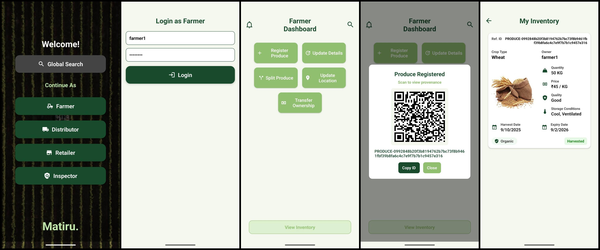
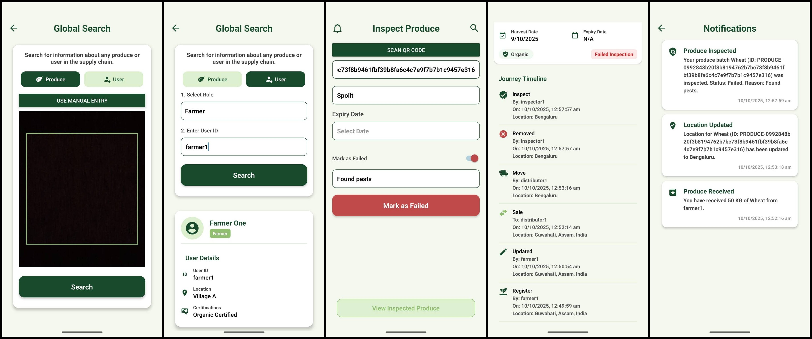

# Matiru

**"Trustable Food, Transparent Journey"**

Matiru is a blockchain-powered agriculture supply chain platform that records every stage of the produce lifecycle - from the farmer to the consumer. It ensures transparency in pricing, quality, and origin, empowering all stakeholders and building consumer trust.

## The Problem

The traditional agricultural supply chain is often plagued by:

- **Opaque Pricing:** Farmers lack visibility into final market prices, leading to exploitation by middlemen
- **Unreliable Quality Checks:** Manual and inconsistent certifications are susceptible to fraud and manipulation
- **Lack of Consumer Trust:** Claims like "Organic" or "Pesticide-Free" are difficult for consumers to verify independently
- **Inefficiencies and Waste:** Poor traceability makes it challenging to manage inventory, recall contaminated batches, and reduce spoilage

## Core Features

- **Farm-to-Fork Traceability:** Every event in a produce's journey—from registration and transport to inspection and sale—is recorded on an immutable ledger
- **Role-Based Dashboards:** A tailored mobile app experience for each stakeholder:
  - **Farmers:** Register produce, generate QR codes, and transfer ownership
  - **Distributors:** Update location, split batches, and manage resale
  - **Retailers:** Confirm inventory and log final sales
  - **Inspectors:** Certify quality and record inspection results on-chain
- **Immutable & Secure:** Built on Hyperledger Fabric, all transactions are cryptographically secured and cannot be altered, preventing fraud
- **Global Chain Access:** A transparent ledger explorer allows authorized users to view all supply chain actions, fostering accountability
- **QR Code Verification:** Consumers can scan a simple QR code on the product packaging to view its entire history, ensuring authenticity and quality

## Architecture

The system is composed of three main parts:

1.  **Hyperledger Fabric Network:** A private, permissioned blockchain where organizations (Farmers, Distributors, Retailers, Inspectors) run peers. A smart contract (`chaincode`) governs all business logic, such as registering produce, transferring ownership, and performing inspections.
2.  **NodeJS Backend:** An API gateway that securely connects the mobile app to the blockchain network. It authenticates users and translates app requests into chaincode invocations.
3.  **React Native Mobile App:** A cross-platform application that provides a user-friendly interface for all stakeholders to interact with the supply chain. It includes offline support to ensure functionality in areas with poor connectivity.

## Tech Stack

- **Blockchain:** Hyperledger Fabric
- **Frontend:** React Native (Expo)
- **Backend:** Node.js, Express
- **Database:** CouchDB (for World State)

## Getting Started

To get a local copy up and running, follow these steps:

### Prerequisites

- Docker & Docker Compose
- NodeJS & `npm`

### Installation

1.  Clone the repository:
    ```sh
    git clone https://github.com/maydayv7/matiru
    cd matiru
    ```
2.  Follow the detailed setup instructions in the **[INSTALL.md](./docs/INSTALL.md)** file to configure the blockchain network, start the server, and run the app

## Preview

Screenshots of the application:




## Documentation

For a more in-depth look at the project, read the following:

- [SOLUTION.md](./docs/SOLUTION.md): Detailed overview of the project
- [MODEL.md](./docs/MODEL.md): Description of the data model and chaincode functions

## License

Distributed under the MIT License  
See [`LICENSE`](./LICENSE) for more information
